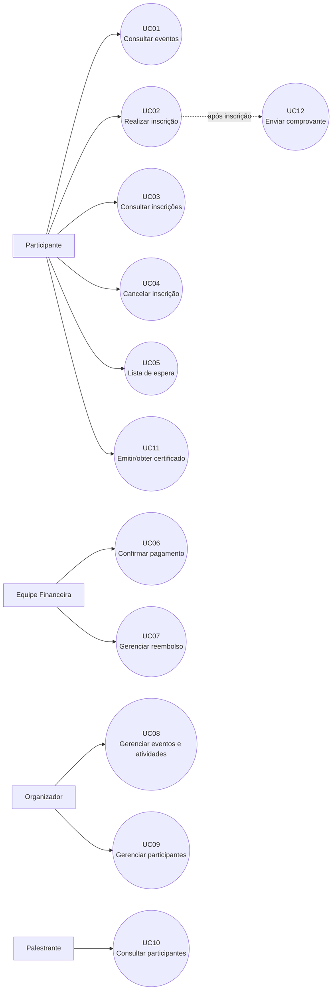

# Casos de Uso — Sistema de Gestão de Eventos

## 1. Objetivo

Este documento especifica os principais casos de uso do **Sistema de Gestão de Eventos da Eventus**, com base nos requisitos funcionais (RF), requisitos não funcionais (RNF), regras de negócio (RN) e informações obtidas nas entrevistas com os stakeholders.

A utilização de casos de uso foi escolhida como principal artefato de especificação por permitir representar as interações entre os usuários e o sistema de forma clara, reduzindo a complexidade da documentação.

As decisões que ainda não foram definidas durante as entrevistas são identificadas como **pendências** e não foram assumidas como regras definitivas.

---

## 2. Atores

| Ator                  | Descrição                                                                                                                  |
| --------------------- | -------------------------------------------------------------------------------------------------------------------------- |
| **Participante**      | Pessoa que consulta eventos, realiza e acompanha inscrições, cancela inscrições e obtém certificados.                      |
| **Organizador**       | Responsável pelo cadastro, configuração e gerenciamento de eventos, atividades e participantes.                            |
| **Equipe Financeira** | Responsável pela confirmação de pagamentos e pelo tratamento de situações de reembolso.                                    |
| **Palestrante**       | Responsável por atividades e autorizado a consultar informações dos participantes de suas atividades, conforme permissões. |

A **Equipe de TI** é stakeholder do projeto, porém não representa um ator diretamente envolvido nas funcionalidades de negócio especificadas neste documento.

---

## 3. Visão geral dos casos de uso

| ID   | Caso de uso                          | Ator(es) principal(is) | Requisitos relacionados            |
| ---- | ------------------------------------ | ---------------------- | ---------------------------------- |
| UC01 | Consultar eventos disponíveis        | Participante           | RF01                               |
| UC02 | Realizar inscrição                   | Participante           | RF05, RF07, RF12, RF13, RF14, RF15 |
| UC03 | Consultar inscrições                 | Participante           | RF06                               |
| UC04 | Cancelar inscrição                   | Participante           | RF03                               |
| UC05 | Entrar na lista de espera            | Participante           | RF08                               |
| UC06 | Confirmar pagamento                  | Equipe Financeira      | RF15                               |
| UC07 | Gerenciar reembolso                  | Equipe Financeira      | RF16                               |
| UC08 | Gerenciar eventos e atividades       | Organizador            | RF11, RF12, RF14                   |
| UC09 | Gerenciar participantes              | Organizador            | RF09, RF10                         |
| UC10 | Consultar participantes da atividade | Palestrante            | RF17                               |
| UC11 | Emitir/obter certificado             | Participante           | RF04, RF18                         |
| UC12 | Enviar comprovante de inscrição      | Sistema                | RF02                               |

> **Observação:** o envio de comprovante foi mantido como caso de uso porque constitui uma funcionalidade explícita do sistema, embora normalmente seja disparado como consequência de uma inscrição.

---

## 4. Diagrama geral de casos de uso

---

# 5. Especificação dos casos de uso

## UC01 — Consultar eventos disponíveis

**Ator principal:** Participante

**Objetivo:** Permitir que o participante visualize os eventos disponibilizados pela Eventus.

**Requisitos relacionados:** RF01.

### Fluxo principal

1. O participante acessa a área de eventos.
2. O sistema consulta os eventos disponíveis.
3. O sistema apresenta os eventos ao participante.
4. O participante seleciona um evento.
5. O sistema apresenta as informações disponíveis sobre o evento e suas atividades.

### Resultado esperado

O participante consegue visualizar os eventos disponíveis e suas respectivas informações.

---

## UC02 — Realizar inscrição

**Ator principal:** Participante

**Objetivo:** Permitir que o participante realize sua inscrição em um evento ou atividade.

**Requisitos relacionados:** RF05, RF07, RF12, RF13, RF14 e RF15.

**Regras relacionadas:** RN01, RN02, RN03, RN05, RN06 e RN09.

### Pré-condições

* O evento ou atividade deve estar disponível para inscrição.
* Deve existir uma capacidade configurada para o evento ou atividade.

### Fluxo principal

1. O participante consulta os eventos disponíveis.
2. O participante seleciona um evento ou atividade.
3. O sistema apresenta as informações da atividade e sua disponibilidade.
4. O participante solicita a inscrição.
5. O sistema verifica a disponibilidade de vagas.
6. O sistema verifica as condições de pagamento do evento.
7. Caso o evento seja gratuito, o sistema processa a inscrição conforme as regras configuradas.
8. Caso o evento seja pago, o sistema solicita o pagamento quando necessário.
9. O sistema registra a inscrição.
10. O sistema atualiza a quantidade de vagas disponíveis.
11. O sistema disponibiliza o comprovante da inscrição.

### Fluxos alternativos

**A1 — Evento lotado**

1. O sistema identifica que a capacidade foi atingida.
2. O sistema não confirma uma nova inscrição.
3. Caso exista lista de espera para o evento, o sistema oferece ao participante a possibilidade de entrar na lista.
4. O participante confirma a entrada na lista de espera.
5. O sistema registra a solicitação.

**A2 — Pagamento obrigatório**

1. O sistema identifica que a confirmação do pagamento é necessária.
2. O sistema direciona o participante para o processo de pagamento.
3. A inscrição permanece pendente até a confirmação do pagamento.
4. Após a confirmação, o sistema libera a inscrição conforme as regras do evento.

**A3 — Atividades no mesmo dia**

1. O participante seleciona mais de uma atividade.
2. O sistema permite a inscrição em atividades que ocorram no mesmo dia.
3. O sistema deve considerar os horários das atividades para tratar eventuais conflitos.

> **Pendência:** ainda não foi definido qual comportamento deverá ocorrer quando o participante tentar se inscrever em atividades com horários conflitantes.

### Resultado esperado

A inscrição é registrada ou, quando aplicável, o participante é encaminhado para pagamento ou lista de espera.

---

## UC03 — Consultar inscrições

**Ator principal:** Participante

**Objetivo:** Permitir que o participante consulte suas inscrições.

**Requisitos relacionados:** RF06.

### Fluxo principal

1. O participante acessa suas inscrições.
2. O sistema recupera as inscrições associadas ao participante.
3. O sistema apresenta as inscrições e seus respectivos status.
4. O participante seleciona uma inscrição para consultar seus detalhes.

### Resultado esperado

O participante consegue acompanhar suas inscrições.

---

## UC04 — Cancelar inscrição

**Ator principal:** Participante

**Objetivo:** Permitir que o participante cancele uma inscrição sem precisar entrar em contato com a organização.

**Requisitos relacionados:** RF03.

**Regra relacionada:** RN07.

### Pré-condições

* O participante deve possuir uma inscrição.
* O evento deve permitir cancelamento.

### Fluxo principal

1. O participante consulta suas inscrições.
2. O participante seleciona uma inscrição.
3. O sistema verifica se o cancelamento é permitido.
4. O sistema apresenta a opção de cancelamento.
5. O participante solicita o cancelamento.
6. O sistema registra o cancelamento.
7. O sistema atualiza o status da inscrição.
8. O sistema trata a vaga de acordo com as regras do evento.

### Fluxos alternativos

**A1 — Cancelamento não permitido**

1. O sistema verifica que o evento não permite cancelamento.
2. O sistema informa ao participante que a inscrição não pode ser cancelada.
3. A inscrição permanece ativa.

**A2 — Inscrição com pagamento**

1. O sistema identifica que a inscrição possui pagamento associado.
2. O sistema verifica se existe direito a reembolso.
3. Caso aplicável, a solicitação de reembolso é encaminhada para o processo correspondente.

### Pendências

Ainda precisam ser definidas:

* prazo máximo para cancelamento;
* possibilidade de configuração desse prazo pelo organizador;
* possibilidade de cancelar somente uma atividade;
* momento em que a vaga será liberada;
* possibilidade de recuperar uma inscrição cancelada;
* regras de reembolso.

---

## UC05 — Entrar na lista de espera

**Ator principal:** Participante

**Objetivo:** Permitir que o participante manifeste interesse em uma atividade ou evento que esteja lotado.

**Requisitos relacionados:** RF08.

**Regra relacionada:** RN04.

### Fluxo principal

1. O participante seleciona um evento ou atividade lotada.
2. O sistema verifica se existe lista de espera habilitada.
3. O sistema oferece a opção de entrar na lista.
4. O participante confirma.
5. O sistema registra o participante na lista de espera.
6. O sistema informa que a inscrição foi registrada na lista.

### Pendências

Ainda precisam ser definidas:

* se a lista será por evento ou por atividade;
* como será definida a ordem dos participantes;
* se uma vaga será oferecida automaticamente;
* prazo para aceitar uma vaga;
* limite de participantes na lista;
* forma de comunicação da disponibilidade da vaga.

---

## UC06 — Confirmar pagamento

**Ator principal:** Equipe Financeira

**Objetivo:** Permitir que pagamentos sejam confirmados quando essa condição for necessária para liberar uma inscrição.

**Requisitos relacionados:** RF15.

**Regra relacionada:** RN06.

### Fluxo principal

1. A equipe financeira acessa os pagamentos pendentes.
2. O sistema apresenta os pagamentos aguardando confirmação.
3. O responsável seleciona um pagamento.
4. O responsável confirma o pagamento.
5. O sistema registra a confirmação.
6. O sistema atualiza o status da inscrição.
7. Caso a confirmação seja requisito para a inscrição, o sistema libera a inscrição.

### Resultado esperado

O pagamento fica registrado como confirmado e a inscrição é liberada quando aplicável.

---

## UC07 — Gerenciar reembolso

**Ator principal:** Equipe Financeira

**Objetivo:** Permitir o tratamento das situações de reembolso relacionadas às inscrições canceladas.

**Requisitos relacionados:** RF16.

**Regra relacionada:** RN08.

### Fluxo principal

1. A equipe financeira acessa as solicitações ou situações de reembolso.
2. O sistema apresenta os dados relacionados à inscrição.
3. O responsável verifica as condições aplicáveis ao evento.
4. O responsável registra o tratamento do reembolso.
5. O sistema registra o resultado da operação.

### Pendências

Ainda precisam ser definidas:

* situações que dão direito ao reembolso;
* se o reembolso será integral ou parcial;
* se o cancelamento automático gera reembolso;
* quem possui autoridade para aprovar o reembolso;
* prazo e forma de processamento.

---

## UC08 — Gerenciar eventos e atividades

**Ator principal:** Organizador

**Objetivo:** Permitir que os organizadores criem, configurem e gerenciem eventos e suas atividades.

**Requisitos relacionados:** RF11, RF12 e RF14.

**Regras relacionadas:** RN01, RN05 e RN10.

### Fluxo principal

1. O organizador acessa o gerenciamento de eventos.
2. O organizador cria ou seleciona um evento.
3. O organizador informa os dados do evento.
4. O organizador configura a quantidade máxima de vagas.
5. O organizador define se o evento é gratuito ou pago.
6. O organizador cadastra as atividades.
7. O organizador informa os horários das atividades.
8. O sistema registra as configurações.

### Resultado esperado

O evento e suas atividades ficam cadastrados e disponíveis conforme as configurações realizadas.

---

## UC09 — Gerenciar participantes

**Ator principal:** Organizador

**Objetivo:** Permitir que o organizador acompanhe e gerencie os participantes dos eventos.

**Requisitos relacionados:** RF09 e RF10.

### Fluxo principal

1. O organizador acessa o gerenciamento de participantes.
2. O sistema apresenta a quantidade de inscritos.
3. O sistema disponibiliza os participantes associados aos eventos.
4. O organizador consulta ou gerencia os dados permitidos.
5. O sistema registra alterações quando aplicável.

### Resultado esperado

O organizador consegue acompanhar a quantidade de inscritos e consultar os participantes de seus eventos.

---

## UC10 — Consultar participantes da atividade

**Ator principal:** Palestrante

**Objetivo:** Permitir que o palestrante consulte os participantes inscritos em suas atividades.

**Requisitos relacionados:** RF17.

### Fluxo principal

1. O palestrante acessa suas atividades.
2. O sistema identifica as atividades vinculadas ao palestrante.
3. O palestrante seleciona uma atividade.
4. O sistema apresenta a lista de participantes autorizada.
5. O palestrante consulta as informações disponíveis.

### Regra de acesso

O palestrante somente poderá visualizar informações para as quais possuir permissão.

### Pendência

Ainda precisa ser definido quais informações pessoais dos participantes poderão ser visualizadas pelos palestrantes.

---

## UC11 — Emitir/obter certificado

**Ator principal:** Participante

**Objetivo:** Permitir que o participante obtenha seu certificado de participação.

**Requisitos relacionados:** RF04 e RF18.

### Fluxo principal

1. O participante acessa seus certificados.
2. O sistema verifica se existe certificado disponível.
3. O sistema disponibiliza o certificado.
4. O participante solicita a emissão ou obtenção.
5. O sistema fornece o certificado ao participante.

### Pendências

Ainda precisam ser definidos:

* se a presença será obrigatória;
* critérios necessários para emissão;
* se o certificado será emitido automaticamente;
* se haverá necessidade de autorização;
* momento em que o certificado ficará disponível.

---

## UC12 — Enviar comprovante de inscrição

**Ator:** Sistema

**Objetivo:** Disponibilizar ao participante um comprovante após a realização da inscrição.

**Requisito relacionado:** RF02.

### Fluxo principal

1. Uma inscrição é concluída ou confirmada.
2. O sistema gera o comprovante.
3. O sistema disponibiliza ou envia o comprovante ao participante.

### Pendências

Ainda precisam ser definidos:

* meio de envio;
* conteúdo do comprovante;
* momento exato do envio;
* eventos que devem gerar notificações;
* outros tipos de notificações que serão enviados.

---

# 6. Requisitos não funcionais aplicáveis

Os requisitos não funcionais não são representados diretamente como ações dos atores, mas devem ser considerados na implementação dos casos de uso.

| Requisito | Aplicação                                                                                                                     |
| --------- | ----------------------------------------------------------------------------------------------------------------------------- |
| RNF01     | Dados pessoais e informações de participantes devem ser protegidos e acessíveis somente conforme as permissões definidas.     |
| RNF02     | Consultas, inscrições e gerenciamento devem apresentar desempenho adequado em períodos de alta demanda.                       |
| RNF03     | Operações importantes devem possuir mecanismos de recuperação diante de falhas.                                               |
| RNF04     | As interfaces utilizadas nos casos de uso devem atender aos requisitos de acessibilidade.                                     |
| RNF05     | Inscrições, pagamentos, cancelamentos e certificados devem possuir registros confiáveis.                                      |
| RNF06     | O processamento das inscrições deve garantir consistência das vagas e impedir que a capacidade configurada seja ultrapassada. |

---

# 7. Regras de negócio utilizadas

| ID   | Regra                                                                                          |
| ---- | ---------------------------------------------------------------------------------------------- |
| RN01 | Cada evento deverá possuir uma quantidade máxima de vagas configurada.                         |
| RN02 | O sistema deverá controlar automaticamente a ocupação das vagas.                               |
| RN03 | Quando um evento atingir sua capacidade, novas inscrições não deverão ser confirmadas.         |
| RN04 | Um evento poderá possuir lista de espera quando estiver lotado.                                |
| RN05 | Eventos poderão ser gratuitos ou pagos.                                                        |
| RN06 | Algumas inscrições dependerão da confirmação do pagamento para serem liberadas.                |
| RN07 | Nem todo evento necessariamente permitirá cancelamento.                                        |
| RN08 | As condições de reembolso poderão variar de acordo com o evento.                               |
| RN09 | O participante poderá se inscrever em várias atividades que ocorram no mesmo dia.              |
| RN10 | Atividades que ocorrerem no mesmo horário deverão ser consideradas simultâneas na programação. |

---

# 8. Pendências para validação com os stakeholders

Os casos de uso foram elaborados sem assumir decisões que ainda não foram definidas. Antes da implementação, as seguintes questões devem ser esclarecidas:

### Cancelamento e reembolso

* Qual é o prazo para cancelamento?
* O prazo poderá ser configurado pelo organizador?
* É possível cancelar apenas uma atividade?
* Quando a vaga será liberada?
* Uma inscrição cancelada poderá ser recuperada?
* Quais situações dão direito a reembolso?
* O reembolso será integral ou parcial?
* O cancelamento automático gera reembolso?

### Lista de espera

* Como o participante entra na lista?
* Qual será a ordem da lista?
* A vaga será oferecida automaticamente?
* Quanto tempo o participante terá para aceitar?
* A lista será por evento ou por atividade?
* Haverá limite de participantes?

### Certificados

* A presença será obrigatória?
* Quais critérios serão necessários para emissão?
* O certificado será emitido automaticamente?
* Quem poderá autorizar a emissão?
* Quando o certificado ficará disponível?

### Comprovantes e notificações

* Quais notificações serão enviadas?
* Quais meios de comunicação serão utilizados?
* Quais eventos gerarão notificações?
* Quais informações estarão no comprovante?
* Quando o comprovante será enviado?

### Inscrição e vagas

* A vaga será reservada durante o pagamento ou somente após sua confirmação?
* Como serão tratadas inscrições em atividades com horários conflitantes?
* A lista de espera será aplicada ao evento ou individualmente às atividades?

### Permissões e privacidade

* Quais informações dos participantes poderão ser visualizadas pelos palestrantes?
* Quais informações poderão ser alteradas pelos organizadores?
* Quais dados serão acessíveis pela equipe financeira?

---

# 9. Rastreabilidade resumida

A tabela abaixo relaciona os requisitos funcionais aos casos de uso que os representam.

| Requisito | Caso de uso |
| --------- | ----------- |
| RF01      | UC01        |
| RF02      | UC12        |
| RF03      | UC04        |
| RF04      | UC11        |
| RF05      | UC02        |
| RF06      | UC03        |
| RF07      | UC02        |
| RF08      | UC05        |
| RF09      | UC09        |
| RF10      | UC09        |
| RF11      | UC08        |
| RF12      | UC02, UC08  |
| RF13      | UC02        |
| RF14      | UC02, UC08  |
| RF15      | UC02, UC06  |
| RF16      | UC07        |
| RF17      | UC10        |
| RF18      | UC11        |

---

# 10. Considerações finais

Os casos de uso selecionados representam as principais interações necessárias para o funcionamento do Sistema de Gestão de Eventos.

A escolha desse artefato reduz a complexidade inicial da especificação porque concentra a descrição das funcionalidades sob a perspectiva dos usuários e dos demais atores envolvidos, sem exigir, neste momento, a elaboração de diversos modelos complementares.

As funcionalidades relacionadas a **inscrição, vagas, pagamentos, cancelamento, reembolso, lista de espera e certificados** receberam maior detalhamento porque apresentam maior quantidade de regras de negócio e situações alternativas.

As decisões ainda não definidas foram mantidas como **pendências de validação**, evitando transformar hipóteses em requisitos. Após a validação com os stakeholders, os casos de uso deverão ser revisados para incorporar as regras definitivas.
