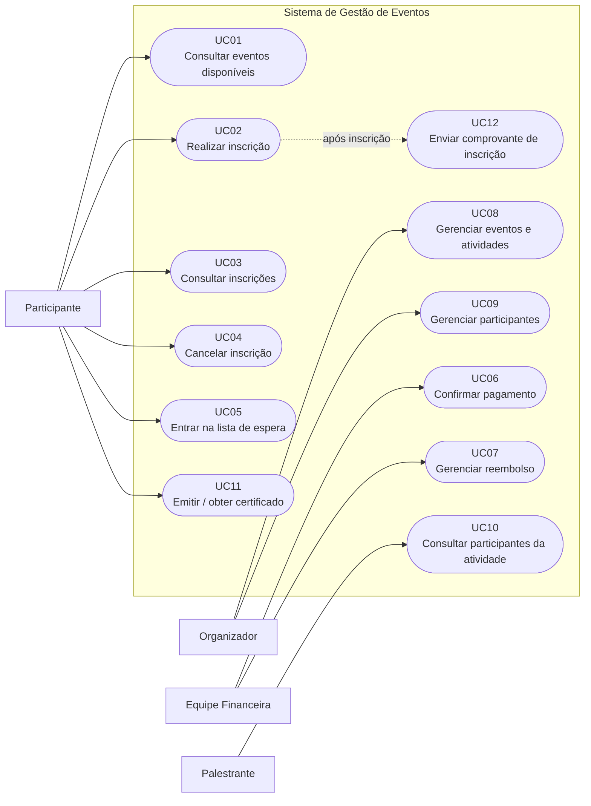

# Diagrama de Casos de Uso — Sistema de Gestão de Eventos

## 1. Objetivo

Este diagrama representa os principais atores e suas interações com o **Sistema de Gestão de Eventos da Eventus**, com base nos requisitos funcionais e nas regras de negócio levantados.

O diagrama foi elaborado utilizando **Mermaid**, permitindo sua visualização diretamente em ambientes que oferecem suporte a esse formato.

## 2. Diagrama

## 3. Atores

| Ator                  | Responsabilidade principal                                                                                                |
| --------------------- | ------------------------------------------------------------------------------------------------------------------------- |
| **Participante**      | Consultar eventos, realizar e acompanhar inscrições, cancelar inscrições, entrar em lista de espera e obter certificados. |
| **Organizador**       | Criar e gerenciar eventos, atividades e participantes.                                                                    |
| **Equipe Financeira** | Confirmar pagamentos e gerenciar situações de reembolso.                                                                  |
| **Palestrante**       | Consultar os participantes de suas atividades, conforme as permissões definidas.                                          |

## 4. Casos de uso representados

| ID   | Caso de uso                          | Ator              |
| ---- | ------------------------------------ | ----------------- |
| UC01 | Consultar eventos disponíveis        | Participante      |
| UC02 | Realizar inscrição                   | Participante      |
| UC03 | Consultar inscrições                 | Participante      |
| UC04 | Cancelar inscrição                   | Participante      |
| UC05 | Entrar na lista de espera            | Participante      |
| UC06 | Confirmar pagamento                  | Equipe Financeira |
| UC07 | Gerenciar reembolso                  | Equipe Financeira |
| UC08 | Gerenciar eventos e atividades       | Organizador       |
| UC09 | Gerenciar participantes              | Organizador       |
| UC10 | Consultar participantes da atividade | Palestrante       |
| UC11 | Emitir / obter certificado           | Participante      |
| UC12 | Enviar comprovante de inscrição      | Sistema           |

## 5. Observação sobre UC12

O caso de uso **UC12 — Enviar comprovante de inscrição** está representado como uma funcionalidade disparada após a realização da inscrição.

Ele não possui um ator humano associado diretamente porque representa uma ação executada pelo próprio sistema como consequência do processo de inscrição.

A definição do meio de envio, momento exato e conteúdo do comprovante ainda permanece como **pendência de especificação**.

## 6. Relação com os requisitos

O diagrama cobre os principais requisitos funcionais identificados:

* **RF01** — UC01
* **RF02** — UC12
* **RF03** — UC04
* **RF04 e RF18** — UC11
* **RF05, RF07, RF12, RF13, RF14 e RF15** — UC02
* **RF06** — UC03
* **RF08** — UC05
* **RF09 e RF10** — UC09
* **RF11** — UC08
* **RF16** — UC07
* **RF17** — UC10

Os requisitos não funcionais e as regras de negócio não aparecem como casos de uso independentes, mas devem ser considerados na especificação e implementação dos casos de uso correspondentes.

## 7. Decisões de modelagem

### Separação por ator

Os casos de uso foram agrupados de acordo com o principal responsável pela interação. Isso facilita a compreensão das responsabilidades de cada perfil e evita um diagrama excessivamente complexo.

### Manutenção da lista de espera como caso de uso

A lista de espera foi mantida como um caso de uso próprio porque possui comportamento específico e regras ainda não definidas, como ordem da fila, prazo de aceitação e forma de convocação.

### Pagamento e reembolso separados

`UC06 — Confirmar pagamento` e `UC07 — Gerenciar reembolso` foram representados separadamente porque possuem responsabilidades distintas e envolvem a equipe financeira em momentos diferentes do ciclo de uma inscrição.

### Certificado como caso de uso

`UC11 — Emitir / obter certificado` concentra as funcionalidades relacionadas ao certificado, evitando criar casos de uso separados para emissão e consulta enquanto as regras de emissão ainda não estão definidas.

## 8. Pendências que podem alterar o diagrama

As seguintes decisões ainda podem exigir ajustes futuros:

* definição do funcionamento da lista de espera;
* regras e prazos de cancelamento;
* regras de reembolso;
* critérios para emissão dos certificados;
* tratamento de conflitos de horário entre atividades;
* definição das permissões dos palestrantes;
* definição do fluxo de notificações e comprovantes;
* definição do momento em que uma vaga é considerada reservada ou confirmada.

Portanto, este diagrama representa a **versão atual da especificação** e deverá ser revisado após a validação dessas questões com os stakeholders.
